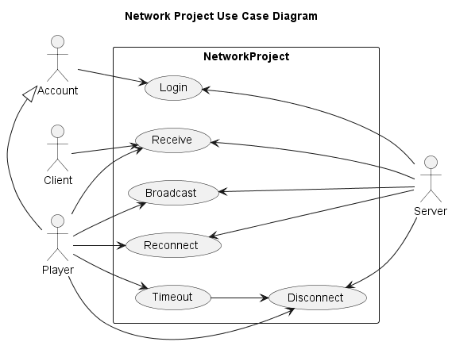

Table of contents:
- [Project description](#project-description)
  - [Wordlist](#wordlist)
- [The user](#the-user)
  - [User needs](#user-needs)
    - [What is a "User need"?](#what-is-a-user-need)
  - [Actors](#actors)
    - [What is an actor?](#what-is-an-actor)
  - [Usecases / User stories](#usecases--user-stories)
  - [Usecase diagram](#usecase-diagram)
  - [Requirement specification](#requirement-specification)
  - [Roles \& Responsibilities](#roles--responsibilities)
    - [Roles](#roles)
    - [Responsibilities](#responsibilities)
- [Dependencies](#dependencies)
- [Installation guide](#installation-guide)

# Project description

This project is an arbitrary project for testing network communication between a server and a client. It aim's create a go-to network boilerplate for the Unity engine. It will make use of a variety of tools and techniques to document the project primarily to educate the target audience of the other aspects to a SDLC.

## Wordlist

|Name|Description|
|---|---|
|User need|The essence of the project|
|Actor| An initiator or recipient of a "usecase"|
|Usecase|---|
|Usecase diagram|---|
|Work package|---|
|Software development LifeCycle (SDLC)|---|

# The user

"The User" for this project, will most likely be a programmer, starting to learn socket network programming, but wanting to skip the complex part and go straight for the implementation of features. More specifically the project targets students using the Unity engine, but should be useable crossplatform, as long as the underlying system supports "dotnet", version [to be decided].

## User needs

* The user needs an easy way to create high-performance multiplayer games via C#, preferably as an asset for the Unity engine. 

### What is a "User need"?

 * [Explanation](https://letmegooglethat.com/?q=what+is+a+user+need)

> ...A user need statement is a concise, articulate way of communicating your user and their need across multiple team members and stakeholders. Once created, it should act as a guiding force...

## Actors

|ID|Name|Description|
|---|---|---|
|1|Account|A person using the library via third-party f.x. as a steam game|
|2|Player|The accounts in-game personification |
|3|Server|Allows accounts to synchronize game-state |
|4|Client|External players in a online match|

### What is an actor?

* [IBM](https://www.ibm.com/docs/en/idsa?topic=model-lesson-13-identify-actors)

> ...In a use-case diagram, users of the system are depicted as actors. Each actor performs a specific role in the system, which is called a use-case. More than one actor can perform a single use-case. An actor can be a person, such as a customer, or a computer, such as a database system or server...

## Usecases / User stories

|ID|Name|Description/story| 
|---|---|---|
|---|---|---|

## Usecase diagram

## Requirement specification

|ID|Name|Actor|MuSCoW|Description|
|---|---|---|---|---|
|0|Send int to client from server|-|Test for the ability to send an int from the server to a specified client, through the internet| ---|
|1|Send int to server from client|-|Same as requirement 0, just in the other direction|---|
|2|Close server|-|Text|---|
|3|Reconnect to server|-|Text|---|
|4|Start local host|-|Text|---|
|5|Multiple clients on a single server|-||---|
|6|GitHub Pages|-|Setup a GitHub Pages webpage for documentation and similar|---|
|7|||||

## Roles & Responsibilities

### Roles
|ID|Name|Description|
|---|---|---|
|1|Network|TCP & UDP Specialist|
|2|Architect|Coordinates software infrastructure|
|3|Developer|Code monkey|
|4|Designer|prioritizes UX and frontend|
|5|Backend|Datebase-guy|

### Responsibilities
|ID|Name|Primary|Secondary|Tertiary|
|---|---|---|---|---|

# Dependencies

# Installation guide

